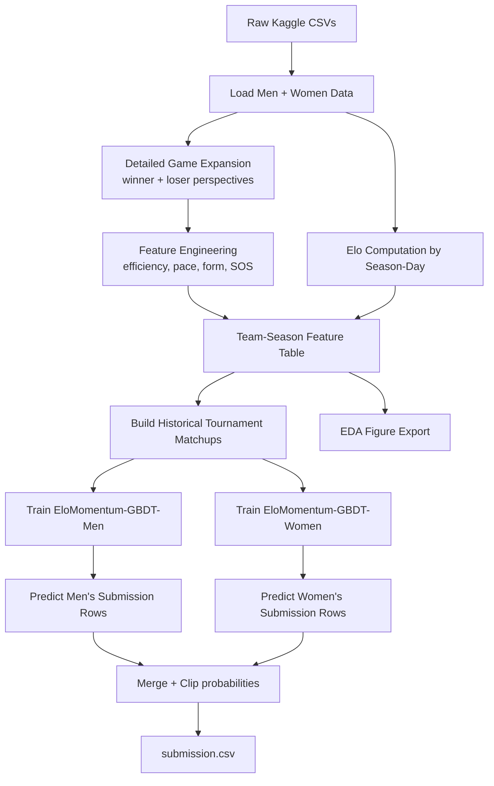
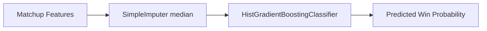

# 🏀 March Machine Learning Mania 2026 Forecast Lab

A fun-but-serious, research-style forecasting pipeline for **Kaggle's March Machine Learning Mania 2026**.

This repo builds explainable team strength features (including **Elo**, efficiency, recent form, and schedule strength), trains gradient-boosted classifiers for men and women, and exports a competition-ready `submission.csv`.

---

## 1) Quick Start

### Download the Kaggle competition data

```bash
kaggle competitions download -c march-machine-learning-mania-2026
```

Then unzip the downloaded archive so the CSV files are available in a single data directory.

### Run the pipeline

```bash
python src/march_mania_research_pipeline.py \
  --data-dir /kaggle/input/competitions/march-machine-learning-mania-2026 \
  --out-path /kaggle/working/submission.csv \
  --fig-dir artifacts/figures
```

---

## 2) Model Names (as requested)

We train two sibling models:

- **EloMomentum-GBDT-Men**
- **EloMomentum-GBDT-Women**

Both are `HistGradientBoostingClassifier` pipelines with median imputation, trained on historical NCAA tournament games using engineered matchup features.

---

## 3) Research Framing

### Objective
Estimate

\[
P(\text{Team}_1 \text{ beats Team}_2 \mid \text{season features, Elo, efficiency, context})
\]

for all matchup IDs required by Kaggle Stage 2 submission format.

### Learning setup
- **Target label**: in each historical tournament matchup, whether the lower TeamID beat the higher TeamID.
- **Feature strategy**:
  - Team-level season features for both teams (`T1_*`, `T2_*`)
  - Pairwise differences (`D_* = T1_* - T2_*`)
- **Validation metric**: **Brier score**, aligning with calibrated probability quality.

---

## 4) Mathematical Core

### 4.1 Elo engine (with home-court adjustment)

Expected winner probability:

\[
E_w = \frac{1}{1 + 10^{-\frac{(R_w + H - R_l)}{400}}}
\]

where:
- \(R_w\), \(R_l\): pre-game Elo ratings,
- \(H\): home-court adjustment (+70 home, -70 away, 0 neutral).

Margin-aware update:

\[
\Delta = K \cdot M \cdot (1 - E_w)
\]

with

\[
M = \log(|\text{margin}| + 1) \cdot \frac{2.2}{0.001(R_w-R_l)+2.2}
\]

Final updates:

\[
R_w' = R_w + \Delta, \quad R_l' = R_l - \Delta
\]

---

### 4.2 Possession and efficiency features

Approximate possessions:

\[
\text{Poss} = FGA - OR + TO + 0.475 \cdot FTA
\]

Offensive / defensive ratings:

\[
OffRtg = 100\cdot\frac{Score}{AvgPoss}, \qquad DefRtg = 100\cdot\frac{OppScore}{AvgPoss}
\]

\[
NetRtg = OffRtg - DefRtg
\]

Additional advanced stats include eFG%, TS%, OR%, DR%, TO%, FT rate, plus recent-form rolling summaries.

---

## 5) Architecture

### 5.1 End-to-end pipeline



### 5.2 Modeling block



---

## 6) EDA & Visual Storytelling

When you run the script, it exports figures to `artifacts/figures/`:

1. `margin_distribution.png` – victory-margin distributions for men vs women.
2. `elo_distribution_latest_season.png` – Elo spread in latest season.
3. `off_def_scatter.png` – offense vs defense profile map.

These visual diagnostics make the project both **research-worthy** and **presentation-ready**.

---

## 7) Why this approach works

- **Elo** captures sequential strength updates and schedule context.
- **Box-score efficiency** captures *how* teams win, not only whether they win.
- **Recent form (last 10)** captures momentum entering March.
- **Pairwise deltas** let the model reason directly in matchup space.
- **GBDT** handles non-linear interactions and missingness robustly.

---

## 8) Project Structure

```text
.
├── README.md
├── src/
│   └── march_mania_research_pipeline.py
└── docs/
    └── figures/
```

---

## 9) Notes

- If running locally (non-Kaggle), just point `--data-dir` to your extracted competition files.
- Probabilities are clipped to `[0.02, 0.98]` to avoid pathological extremes.

Good luck in March — may your brackets be bold and your calibration even better. 🔥📈
